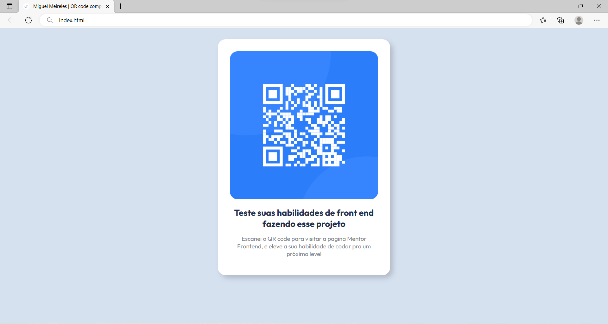

# Frontend Mentor - QR code component solution

Esse projeto foi um desafio do site Frontend Mentor, na qual eu teria que fazer um cartão com um QR code, utilizei as tecnologias HTML e CSS para concluir o desafio.

## Table of contents

- [Overview](#overview)
  - [Screenshot](#screenshot)
- [My process](#my-process)
  - [Built with](#built-with)
  - [What I learned](#what-i-learned)

## Overview

### Screenshot

## My process

### Built with

- HTML
- CSS

### What I learned
Nesse projeto eu aprendi a criar um cartão com um QRcode que redireciona para o site Frontend Mentor, utilizei o HTML e o CSS para modificar o estilo do cartão

## Author

- Github - [miguelmeirelles](https://github.com/miguelmeirelles)
- Instagram - [@miguelmeirelles](https://www.instagram.com/miguelmeirelles/)

